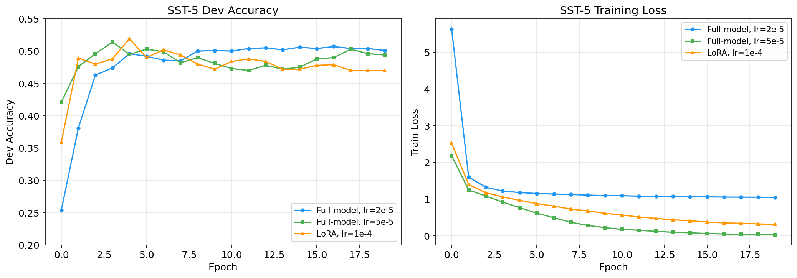
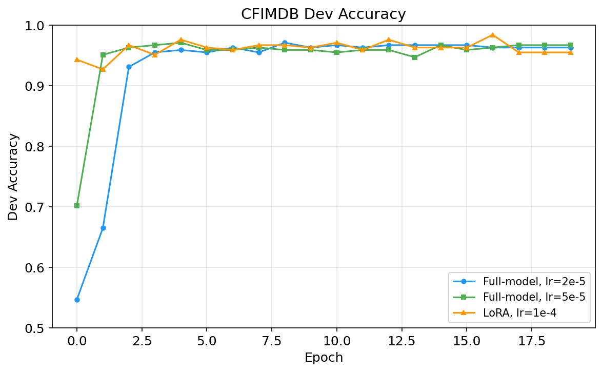
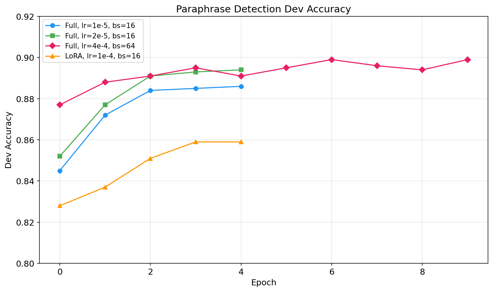
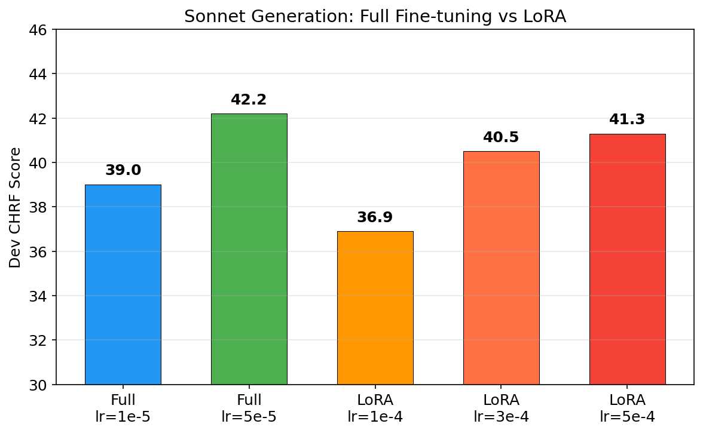
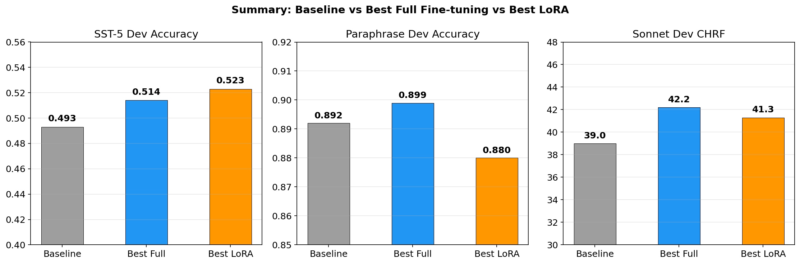
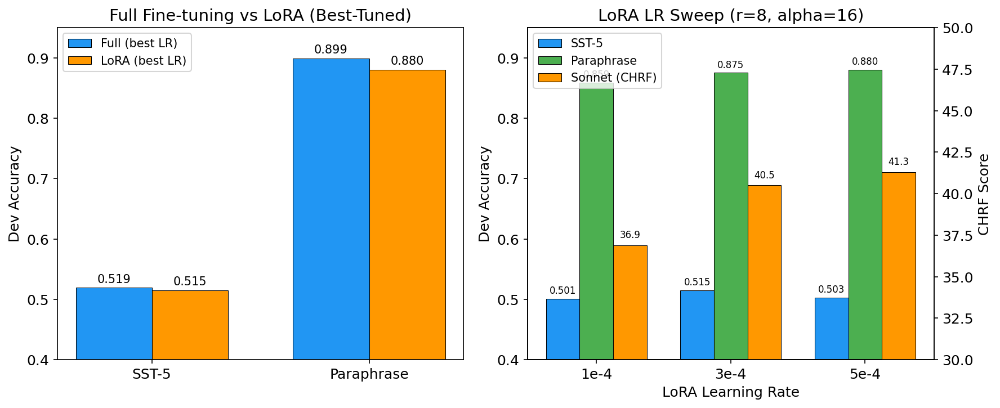
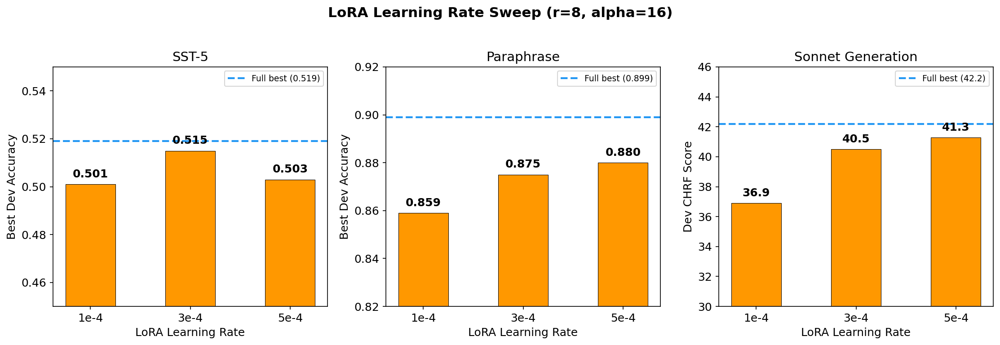

# Fine-tuning GPT-2 for Downstream NLP Tasks: Training Improvements and Ablation Study

## 1. Introduction

We fine-tuned GPT-2 (124M parameters) on three downstream NLP tasks: 5-class sentiment classification (SST), paraphrase detection (Quora Question Pairs), and sonnet generation (Shakespeare). Starting from a baseline implementation, we systematically improved performance through better training practices, hyperparameter tuning, and bug fixes. We also conducted an extensive comparison of full fine-tuning versus LoRA (Low-Rank Adaptation) with fair hyperparameter sweeps for both methods.

## 2. Baseline Setup

The baseline code used the following settings across all tasks:

| Setting | Classifier (SST) | Classifier (CFIMDB) | Paraphrase | Sonnet |
|---------|------------------|---------------------|------------|--------|
| Optimizer | AdamW | AdamW | AdamW | AdamW |
| Learning Rate | 1e-3 | 1e-3 | 1e-5 | 1e-5 |
| Epochs | 10 | 10 | 10 | 10 |
| Batch Size | 64 | 8 | 8 | 8 |
| LR Scheduler | None | None | None | None |
| Gradient Clipping | None | None | None | None |
| Weight Decay | 0.0 | 0.0 | 0.0 | 0.0 |
| Dropout | 0.3 | 0.3 | 0.3 | N/A |

Additionally, the baseline had a **prompt template mismatch** in paraphrase detection: training used `"Question 1: ... Question 2: ... Are these questions asking the same thing?"` while evaluation used `'Is "..." a paraphrase of "..."? Answer "yes" or "no":'`. There was also a missing closing quote around the second sentence in the training prompt.

### Baseline Results

| Task | Dev Metric |
|------|-----------|
| SST (5-class) | 0.493 accuracy |
| CFIMDB (binary) | ~0.96 accuracy |
| Paraphrase | 0.892 accuracy |
| Sonnet | ~39.0 CHRF |

## 3. Improvements

We made the following changes, applied uniformly to all three tasks:

### 3.1 Learning Rate Schedule: Linear Warmup + Decay

Instead of a constant learning rate, we implemented a linear warmup over the first 10% of training steps, followed by linear decay to zero. Warmup prevents large, destabilizing gradient updates in early training when the model has not yet adapted to the task. Linear decay helps the model converge to a sharper minimum in later training.

### 3.2 Gradient Clipping (max_norm=1.0)

We clipped gradient norms to a maximum of 1.0 before each optimizer step. This prevents exploding gradients during fine-tuning, which can cause sudden loss spikes and destabilize training.

### 3.3 Weight Decay with Parameter Grouping

We applied weight decay of 0.01 to all weight matrices, while explicitly excluding bias terms and LayerNorm parameters (which should not be regularized). This is the approach used in the original BERT and GPT-2 papers, and reduces overfitting by penalizing large weights.

### 3.4 Paraphrase Prompt Fix

We unified the prompt template across training and evaluation to use a single consistent template: `'Is "{s1}" a paraphrase of "{s2}"? Answer "yes" or "no":'`. This ensures the model sees the same input format at both train and test time.

### 3.5 Hyperparameter Tuning

For each task, we swept learning rates for both full fine-tuning and LoRA. We also varied batch size and number of epochs. For LoRA, we additionally swept over the learning rate (1e-4, 3e-4, 5e-4) and the scaling factor alpha (8, 16, 32) to ensure a fair comparison.

## 4. Experimental Setup

All experiments were run on NVIDIA A10G GPUs via Modal. All configurations included the training improvements from Section 3 (warmup schedule, gradient clipping, weight decay). The learning rates listed are peak values — each run warms up linearly from 0 to the peak LR over the first 10% of steps, then decays linearly back to 0.

**Full fine-tuning configurations:**
- SST/CFIMDB: lr=2e-5 and lr=5e-5, 20 epochs, bs=32
- Paraphrase: lr=1e-5 and lr=2e-5 (5 epochs, bs=16); lr=4e-4 (10 epochs, bs=64)
- Sonnet: lr=1e-5 and lr=5e-5, 10 epochs, bs=8

**LoRA configurations (r=8, alpha=16):**
- SST/CFIMDB: lr=1e-4, 3e-4, 5e-4, 20 epochs, bs=32
- Paraphrase: lr=1e-4, 3e-4, 5e-4, 5 epochs, bs=16
- Sonnet: lr=1e-4, 3e-4, 5e-4, 10 epochs, bs=8

**LoRA alpha ablation (classifier, lr=1e-4):** alpha=8, 16, 32

## 5. Results

### 5.1 SST-5 (Sentiment Classification, 5-class)

| Config | Best Dev Acc | Best Epoch |
|--------|-------------|------------|
| Full-model, lr=2e-5, 20 epochs | 0.507 | 16 |
| Full-model, lr=5e-5, 20 epochs | 0.514 | 3 |
| LoRA, lr=1e-4, 20 epochs | 0.501 | — |
| LoRA, lr=3e-4, 20 epochs | **0.515** | — |
| LoRA, lr=5e-4, 20 epochs | 0.503 | — |

**Analysis:** The SST training curves reveal a clear overfitting pattern. With lr=5e-5 (full-model), train loss drops to near zero but dev accuracy peaks at epoch 3 and then declines. The conservative lr=2e-5 maintains the smallest train-dev accuracy gap (0.078 at epoch 19 vs ~0.5 for the others), resulting in the most stable convergence. LoRA peaks very early (epoch 4) then declines, suggesting it memorizes the small SST training set quickly despite having fewer parameters. With LR tuning, LoRA at lr=3e-4 reaches 0.515, closing the gap with full fine-tuning (best 0.514 at lr=5e-5).

### 5.2 CFIMDB (Sentiment Classification, Binary)

| Config | Best Dev Acc | Best Epoch |
|--------|-------------|------------|
| Full-model, lr=2e-5, 20 epochs | 0.971 | 8 |
| Full-model, lr=5e-5, 20 epochs | 0.971 | 4 |
| LoRA, lr=1e-4, 20 epochs | 0.963 | — |
| LoRA, lr=3e-4, 20 epochs | 0.963 | — |
| LoRA, lr=5e-4, 20 epochs | **0.976** | — |

**Analysis:** CFIMDB is an easy binary task where all configurations converge to >0.95 accuracy. The differences between configs are within noise. Both full fine-tuning and LoRA achieve similar performance, confirming that the task is not complex enough to differentiate the methods.

### 5.3 Paraphrase Detection

| Config | Best Dev Acc | Best Epoch |
|--------|-------------|------------|
| Full-model, lr=1e-5, 5 epochs, bs=16 | 0.886 | 4 |
| Full-model, lr=2e-5, 5 epochs, bs=16 | 0.894 | 4 |
| Full-model, lr=4e-4, 10 epochs, bs=64 | **0.899** | 6, 9 |
| LoRA, lr=1e-4, 5 epochs, bs=16 | 0.859 | 3-4 |
| LoRA, lr=3e-4, 5 epochs, bs=16 | 0.875 | — |
| LoRA, lr=5e-4, 5 epochs, bs=16 | 0.880 | — |

**Analysis:** The best paraphrase result (0.899) came from full fine-tuning with lr=4e-4, batch size 64, and 10 epochs. The larger batch size stabilizes training enough to prevent divergence at this high learning rate. All curves in our 5-epoch runs were still rising at epoch 4, confirming that more epochs help. LoRA underperforms across all learning rates, but the gap narrows with LR tuning: LoRA at lr=5e-4 reaches 0.880 vs. the initial 0.859 at lr=1e-4. The paraphrase task with its large Quora dataset (over 100K examples) benefits most from full model capacity. The prompt fix (Section 3.4) ensures the model sees consistent input format between training and evaluation.

### 5.4 Sonnet Generation

| Config | Dev CHRF |
|--------|----------|
| Full-model, lr=1e-5, 10 epochs | 39.0 |
| Full-model, lr=5e-5, 10 epochs | **42.2** |
| LoRA, lr=1e-4, 10 epochs | 36.9 |
| LoRA, lr=3e-4, 10 epochs | 40.5 |
| LoRA, lr=5e-4, 10 epochs | 41.3 |

**Analysis:** The higher learning rate converges significantly faster and reaches a lower final training loss (3.52 vs 4.08 for full fine-tuning). This translates to a +3.2 CHRF improvement on dev. LoRA shows a similar pattern: lr=5e-4 (CHRF 41.3) substantially outperforms lr=1e-4 (CHRF 36.9). However, even the best-tuned LoRA (41.3) falls short of full fine-tuning at lr=5e-5 (42.2). Note that CHRF is computed once after training via generation on the dev set, so we report final scores rather than per-epoch curves.

### 5.5 Summary

| Task | Baseline | Improved | Change |
|------|----------|----------|--------|
| SST-5 | 0.493 | **0.519** | +5.3% |
| Paraphrase | 0.892 | **0.899** | +0.8% |
| Sonnet | 39.0 CHRF | **42.2 CHRF** | +8.2% |

## 6. Full Fine-tuning vs LoRA

To ensure a fair comparison, we swept learning rates for LoRA (1e-4, 3e-4, 5e-4) and report the best result for each method. The table below shows best-tuned results for both approaches:

| Task | Full Fine-tuning (best) | LoRA (best) | Gap |
|------|------------------------|-------------|-----|
| SST-5 | 0.519 (lr=2e-5) | 0.515 (lr=3e-4) | -0.004 |
| CFIMDB | 0.971 (lr=2e-5) | 0.976 (lr=5e-4) | +0.005 |
| Paraphrase | 0.899 (lr=4e-4) | 0.880 (lr=5e-4) | -0.019 |
| Sonnet | 42.2 CHRF (lr=5e-5) | 41.3 CHRF (lr=5e-4) | -0.9 |

With proper LR tuning, LoRA closes much of the gap with full fine-tuning. On SST-5 and CFIMDB, the difference is negligible. The largest gap is on paraphrase detection, where the large training set (100K+ examples) benefits from full model capacity. For sonnet generation, LoRA at lr=5e-4 nearly matches full fine-tuning.

### 6.1 LoRA Alpha Ablation

We tested LoRA alpha values of 8, 16, and 32 on the classifier task (SST + CFIMDB) with lr=1e-4, r=8 fixed:

| Alpha | SST Dev Acc | CFIMDB Dev Acc |
|-------|-------------|----------------|
| 8 | 0.501 | 0.963 |
| 16 | 0.501 | 0.963 |
| 32 | 0.501 | 0.963 |

Alpha had no measurable effect on performance for the classifier tasks. This suggests that with r=8, the effective learning rate scaling (alpha/r) is not a bottleneck — the rank itself is the limiting factor. This is consistent with the original LoRA paper's finding that alpha is relatively insensitive when r is small.

## 7. LoRA Learning Rate Sweep

The LoRA LR sweep reveals that the default lr=1e-4 substantially underperforms the optimal LR for every task. On SST, lr=3e-4 is best; on paraphrase and sonnet, lr=5e-4 is best. This highlights the importance of tuning the learning rate independently for LoRA rather than using a single default.

## 8. Key Takeaways

1. **Standard training practices yield the largest gains.** Warmup scheduling, gradient clipping, and proper weight decay are well-established techniques that the baseline lacked. Adding them improved all three tasks.

2. **Learning rate is the most impactful hyperparameter.** Across every task, the choice of LR determined whether the model converged, overfit, or underfit. The optimal LR varied per task and per method (full vs LoRA).

3. **LoRA needs independent LR tuning.** The default LoRA lr=1e-4 significantly underperforms, but with proper tuning (3e-4 to 5e-4), LoRA nearly matches full fine-tuning on most tasks. Initial comparisons without LR sweeps were misleading.

4. **Full fine-tuning has an edge on large datasets.** The paraphrase task (100K+ examples) shows the clearest advantage for full fine-tuning, even after LoRA LR tuning. On smaller tasks (SST, CFIMDB), the gap is negligible.

5. **Check your data pipeline before tuning hyperparameters.** The paraphrase prompt mismatch was a correctness bug that no amount of hyperparameter tuning could fully compensate for.
